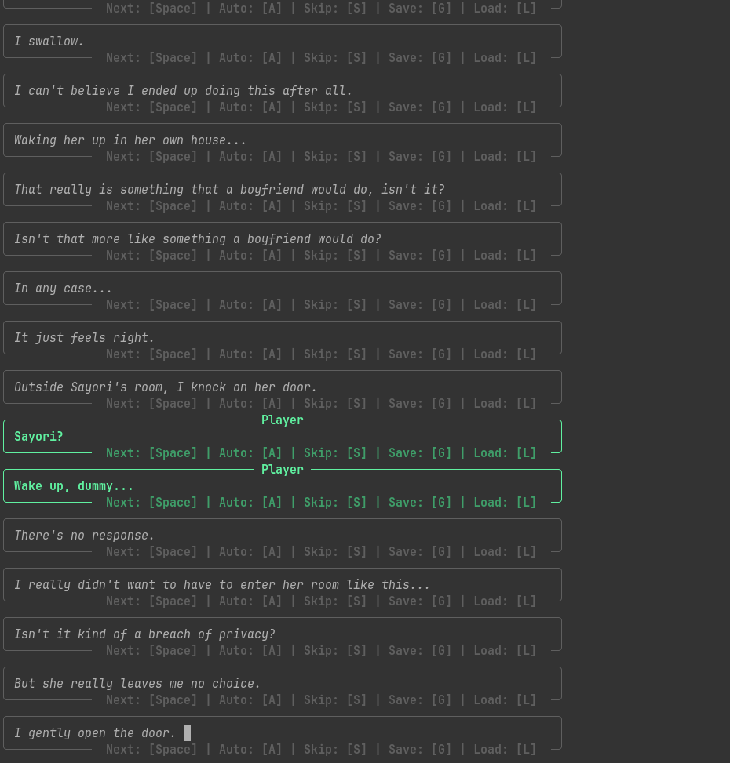
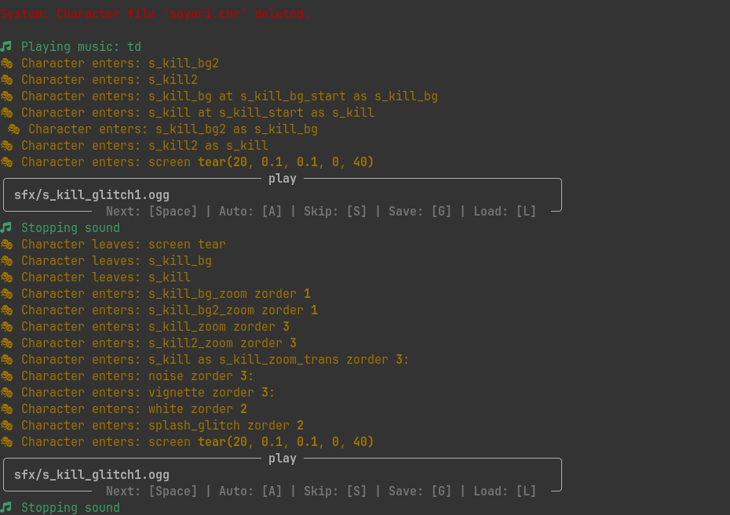

# 🎀 Doki Doki CLI Club! (DDCC)


> *"Welcome to the Literature Club! Write your way into her heart... directly inside your favorite terminal interface."* 💚

```
┌──────────────────────────────────────────────────────────┐
│              🎀 DOKI DOKI CLI CLUB! 🎀                  │
│   "Welcome to the Literature Club... in your shell."     │
└──────────────────────────────────────────────────────────┘
```

**Doki Doki CLI Club! (DDCC)** is an ultra-lightweight, high-performance command-line visual novel engine that **cuts** through GUI overhead and lets you **hang** out with the Literature Club in pure ASCII glory.

Whether you're **baked** into SSH sessions or just want a **byte-sized** poem reading experience, DDCC brings the full psychological horror and wholesome clubroom vibes directly to your shell—with **no strings attached!** 🧵

---

## 📸 Memorable Moments

> *"I gently open the door..."* (Spoiler: Don't **hang** around too long!) 💔

| *"I gently open the door."* | Character File Deletion Indicator |
| :---: | :---: |
|  |  |

---

## ✨ Key Features (Freshly Baked & Sharp!)

* ⚡ **Zero-GUI Overhead**: **Cut** through bloated graphics! Play over SSH, headless servers, or inside your favorite terminal emulator.
* 🎨 **Character-Accurate Palette (Coloring outside the lines!)**:
  * 🩵 **Sayori**: Sky Blue (`sky_blue1`) — *Don't leave her hanging!*
  * 🩷 **Natsuki**: Pastel Pink (`pink1`) — *Freshly baked aesthetics, because **Manga IS Literature!***
  * 💜 **Yuri**: Deep Purple (`purple`) — *A sharp, cutting-edge style that gets straight to the point.*
  * 💚 **Monika**: Emerald Green (`green`) — *Just Monika. Period.*
* 📜 **Dedicated TUI Poem Reader**: Read handwritten poems (`poem_s1`, `poem_y1`, `poem_n1`, `poem_m1`) rendered inside **picture-perfect** Rich paper panels.
* 📖 **Ren'Py Text Tag Markup**: Automatically parses `{i}` (italics), `{b}` (bold), `{u}` (underline), `{s}` (strikethrough), and `{color=...}` tags. Unclosed tags are automatically **bound** frame-by-frame during typewriter typing!
* 🎮 **Bottom Dialogue Quick-Menu**:
  * `[Space]` : Advance to the next line of dialogue (or **fast-forward** the pen!).
  * `[A]` : Toggle **Auto-Play** mode (*look ma, no hands!*).
  * `[S]` : Toggle **Skip Mode** (*fast-forward at neck-breaking speeds!*).
  * `[G]` : **Save Game** state to disk (`savegame.json`).
  * `[L]` : **Load Game** state from disk (don't worry, Monika didn't delete it... *yet*).
* 📝 **In-Place Split TUI Poem Minigame**: A side-by-side split TUI layout where Sayori **bounces**, Natsuki **hops**, and Yuri **smiles** in real-time as you pick words!
* 🎯 **In-Place TUI Decision Menus**: Make club choices without scrolling pollution! Options update in-place with `Up/Down` or `W/S` keys.
* 🔀 **Dynamic Ren'Py Flow Control**: Evaluates dynamic Ren'Py call expressions (`call expression poemwinner[0] + "_exclusive"`) on the fly.
* 💾 **Bulletproof JSON Save System**: Trial-tested JSON serialization that **deletes** bad save bugs before Monika can delete your character files.

---

## 🚀 Setup & Execution (Piece of Cake! 🧁)

### 0. Get original DDLC
Download Doki Doki Literature Club! from [offical webpage](https://ddlc.moe)
### 1. Prerequisites
Ensure you have Python 3.7+ installed. Install the required dependencies:
```bash
pip install rich readchar rpycdec
```

### 2. Prepare Game Files
Place the official PC game directory named **`DDLC-1.1.1-pc`** into the root of this repository. Your directory layout should look like this:
```
DDCC/
├── DDLC-1.1.1-pc/       # Place official DDLC game directory here
├── decompile_scripts.py
├── engine.py
├── parser.py
├── screenshot/          # Memorable moments screenshots
└── README.md
```

### 3. Extract & Decompile Scripts
Unpack `.rpa` archives and decompile `.rpyc` bytecode into readable `.rpy` scripts:
```bash
python decompile_scripts.py
```
*This **unzips** the secret recipe into `game_scripts/`!*

### 4. Run the Game!
Start the visual novel interpreter:
```bash
python engine.py
```

---

## 🕹️ Controls & Hotkeys

| Action | Shortcut Key | Description |
| :--- | :---: | :--- |
| **Next Line / Finish Poem** | `Space` | Advance dialogue / finish reading poem / fast-forward typewriter |
| **Auto-Play** | `A` | Toggle automatic line advancement |
| **Skip Mode** | `S` | Fast-forward all dialogue; press any key to stop |
| **Save Game** | `G` | Save current game state to `savegame.json` |
| **Load Game** | `L` | Load last saved game state (in-game or at startup) |
| **Menu Select** | `Enter` / `Space` | Confirm selection in Decision menu or Poem minigame |
| **Navigate** | `Up` / `Down` or `W` / `S` | Move cursor in menus |

---

## 🛠️ Architecture Overview (Behind the Scenes!)

* **[decompile_scripts.py](file:///home/bgkang/Projects/DDCC/decompile_scripts.py)**: Extracts `scripts.rpa`, runs `rpycdec` bytecode decompilation to `.rpy`, and cleans up output folders.
* **[parser.py](file:///home/bgkang/Projects/DDCC/parser.py)**: Indentation-based Ren'Py syntax parser. Constructs structured AST nodes (`label`, `dialogue`, `if/elif/else`, `menu`, `call_expr`, `jump_expr`, `python_block`).
* **[engine.py](file:///home/bgkang/Projects/DDCC/engine.py)**: Main runtime engine. Features non-blocking TTY input handling, state sandbox evaluation, Rich panel rendering, `display_poem()` TUI console, save/load serialization, and the interactive Poem writing minigame.

---

> ⚠️ **Warning**: *Side effects of playing DDCC may include sudden urges to write 20-word poems at 3 AM, extreme emotional attachment to terminal windows, and double-checking your `characters/` folder.* 💚
